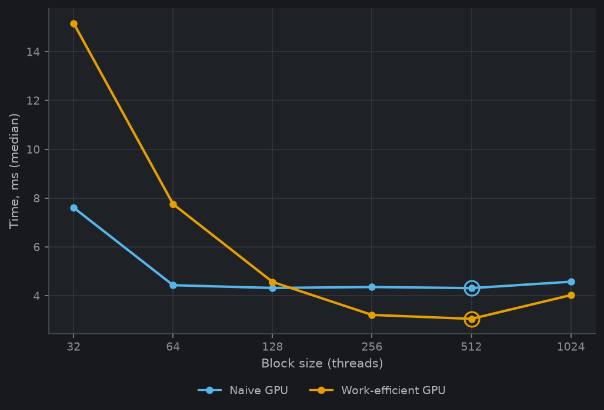
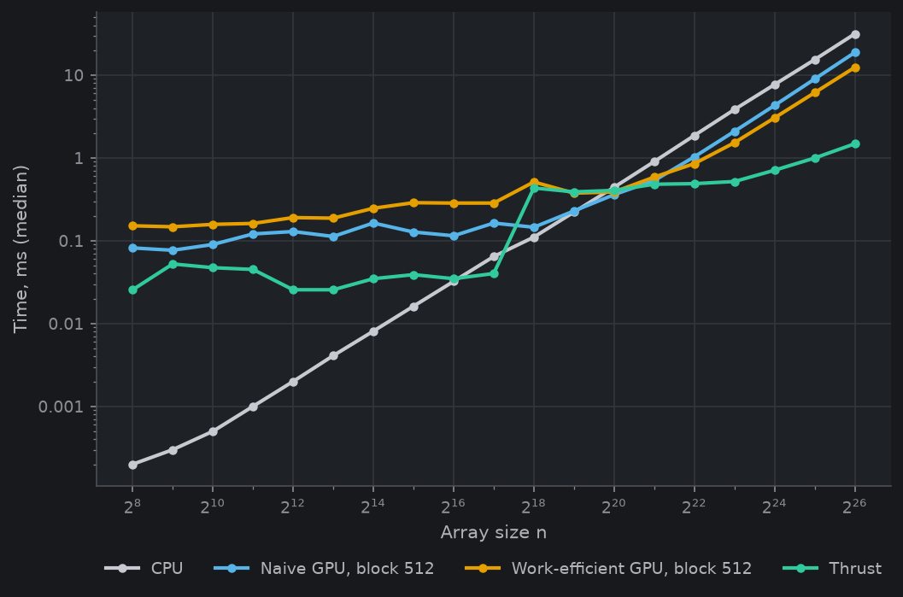
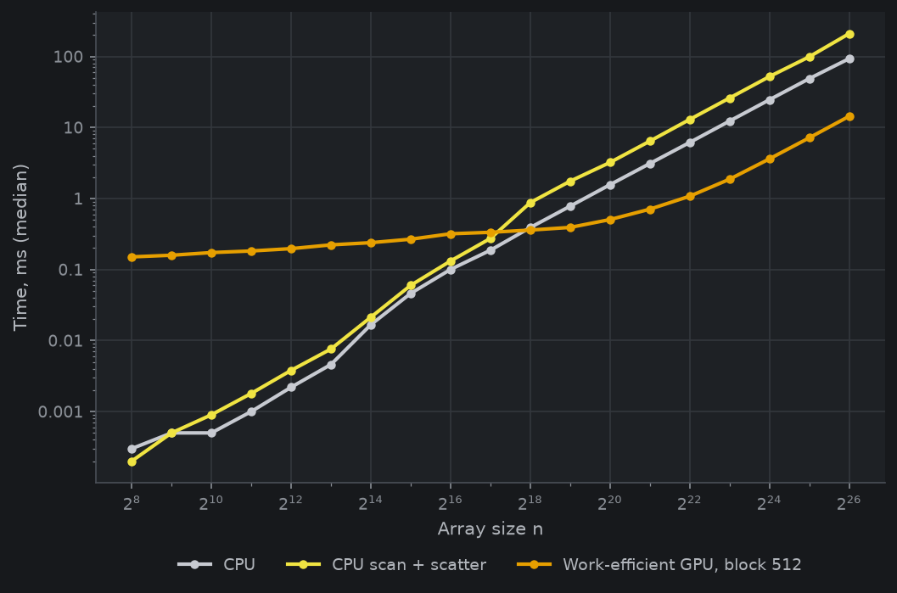
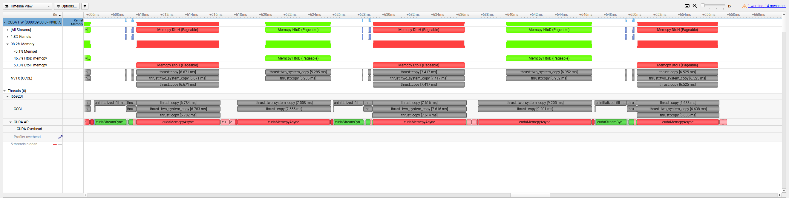

CUDA Stream Compaction
======================

**University of Pennsylvania, CIS 565: GPU Programming and Architecture, Project 2**

* Yichen Huang
    - [LinkedIn](https://www.linkedin.com/in/yichen-huang-970b582bb/), [personal website](https://as7tesia.com/)
* Tested on: Windows 11, AMD Ryzen 5950X @ 4.3GHz (PBO Enabled), 64GB(3200 MT/s), RTX 3090 24GB


## Project Description
In this project I implemented:
- CPU Scan, CPU Stream Compaction
- Naive GPU Scan, Stupid Work-Efficient GPU Scan, Less-Stupid Work-Efficient GPU Scan
- GPU Stream Compaction

## Performance

All timings are medians of 5 runs from `profiling/summary.md`. GPU numbers are CUDA event time around the kernels only, `cudaMalloc`/`cudaMemcpy` are outside
the timer. CPU numbers are `std::chrono`.

With help of AI, I created a separate benchmark executable, which sweeps array size from 2^8 to 2^64, and block sizes from 32 to 1024.
## Performance Data
### Block size

Time at n = 2^24 by block size (ms):

| Block size | Naive scan | Work-efficient scan (full launch) | Work-efficient compact (full launch) | Work-efficient scan (compacted) | Work-efficient compact (compacted) |
|---|---|---|---|---|---|
| 32 | 7.5622 | 16.2604 | 15.8699 | 2.0247 | 2.8676 |
| 64 | 4.4252 | 8.3297 | 8.3170 | 2.0699 | 2.7264 |
| 128 | 4.4155 | 4.6031 | 5.1905 | 2.1882 | 2.8222 |
| 256 | 4.3769 | 3.1734 | 3.8579 | 2.1303 | 2.7015 |
| 512 | 4.3875 | 2.9822 | 3.6392 | 2.1445 | 2.7353 |
| 1024 | 4.5697 | 4.0491 | 4.7091 | 2.1216 | 2.8692 |



*Scan time vs block size at n = 2^24. The ring marks the fastest block size for each implementation.* (Thrust has no block size to tune.)

### Scan vs array size



*Scan time vs array size, log-log. Each implementation at its fastest block size.*

Scan time (ms), each GPU implementation at its best block size:

| n | CPU | Naive | Work-efficient (full launch) | Work-efficient (compacted) | Thrust |
|---|---|---|---|---|---|
| 2^8 | 0.0002 | 0.0440 | 0.0829 | 0.1260 | 0.0502 |
| 2^10 | 0.0008 | 0.0819 | 0.1126 | 0.1362 | 0.0532 |
| 2^12 | 0.0033 | 0.0881 | 0.1526 | 0.1618 | 0.0523 |
| 2^14 | 0.0134 | 0.1004 | 0.1853 | 0.2109 | 0.0345 |
| 2^16 | 0.0492 | 0.1098 | 0.2568 | 0.2921 | 0.0461 |
| 2^18 | 0.1234 | 0.1395 | 0.2848 | 0.2897 | 0.3708 |
| 2^20 | 0.4773 | 0.2514 | 0.3710 | 0.2973 | 0.4086 |
| 2^22 | 2.1993 | 1.0370 | 0.8879 | 0.6708 | 0.4997 |
| 2^24 | 8.3896 | 4.3769 | 2.9822 | 2.0247 | 0.6656 |
| 2^26 | 37.2738 | 18.8859 | 11.8822 | 7.5046 | 1.5688 |

### Stream compaction vs array size



*Stream compaction time vs array size, log-log. Each implementation at its fastest block size.*

Compaction time (ms):

| n | CPU | CPU scan + scatter | Work-efficient (full launch) | Work-efficient (compacted) |
|---|---|---|---|---|
| 2^8 | 0.0001 | 0.0003 | 0.1393 | 0.1659 |
| 2^10 | 0.0005 | 0.0009 | 0.1516 | 0.1597 |
| 2^12 | 0.0022 | 0.0039 | 0.1731 | 0.1782 |
| 2^14 | 0.0170 | 0.0200 | 0.2243 | 0.2509 |
| 2^16 | 0.0928 | 0.1241 | 0.3054 | 0.2783 |
| 2^18 | 0.4058 | 0.8174 | 0.3008 | 0.2829 |
| 2^20 | 1.6580 | 3.3120 | 0.3779 | 0.3473 |
| 2^22 | 6.0907 | 15.6234 | 1.0047 | 0.8408 |
| 2^24 | 23.9867 | 51.7293 | 3.6392 | 2.7015 |
| 2^26 | 92.7021 | 232.7939 | 14.5174 | 10.5666 |

## Analysis
### Why is my work-"efficient" scan so slow???
#### Observation
The work-efficient scan only beats naive past 2^22 and is still ~8x behind Thrust at 2^26. The block size
sweep is the real tell though: at 2^24 it goes 15.2 ms at block 32, 7.8 at 64, 4.6 at 128, 3.1 at 512. Naive
over the same range is flat (4.4 -> 4.3 ms). A memory-bound kernel doesn't halve when you double the block size.
That curve is the cost of dispatching blocks, so most of what I'm launching must not be doing anything.

#### Reasoning


- We can see that for unoptimized Work-efficient GPU Scan, there is a huge difference between performance with respect to block sizes. This is because it launches the kernel with same block size for each iteration, and thus creates many dead warps.
- Lets take block size 512 for example. At iteration depth 0 to 4, which has stride lengths 2, 4, 8, 16, 32, every warp still has at least one active lane, but at each iteration there is only 16, 8, 4, 2, 1 of the 32 lanes active, which is huge divergence cost.
- At iteration depth 5 above, the stride length is now wider than a warp's total number of lanes, so only one of many warps has exactly one active lane. ALl the other warps are just launching computing index and exiting because they fail the stride comparison. From this we can see why this approach is very slow.
- Surprisingly (or unsurprisingly), assuming an array size of $2^{24}$, total number of working threads we need is $2^{23} + 2^{22} + ... + 1 = 2^{24} - 1$. At 32 lanes per warp that's $2^{24}$ / 32 = $2^{19}$ warps. However I launch total of 24 levels x $2^{19}$ = $24 \cdot 2^{19}$ warps, which means only __4%__ of what gets scheduled does anything, and __96%__ warps are just pure scheduling overhead (skull emoji here).
- As visible in the graph, larger block sizes hides this performance loss more, because it dispatches less blocks that does absolutely nothing.
- I also thought that padding to a power of two was a big issue because worst case it's almost 2x (33 -> 64), but I later realized in my sweep everything is already a power of 2 so that wasn't part of the issue at all.

#### Fix
By doing some index math: at level d there are exactly `paddedN >> (d+1)` working threads, so launch that many (grid
size computed per level, min 1 block) and have thread `k` handle the node the old code reached at
`index = k << (d+1)`. The read/write offsets stay the same, the modulo check goes away. Same change in the down-sweep.
Warps per sweep drop from 24 * 2^19 to ~2 * 2^19. Divergence only remains in the last 5
levels where there are fewer than 32 threads total.

#### After Fix Comparison
**Scan at 2^24 by block size (ms):**

| block | 32 | 64 | 128 | 256 | 512 | 1024 |
|---|---|---|---|---|---|---|
| full launch | 16.26 | 8.33 | 4.60 | 3.17 | 2.98 | 4.05 |
| compacted | 2.02 | 2.07 | 2.19 | 2.13 | 2.14 | 2.12 |


*The ring marks the fastest block size for each implementation.*


The block size curve went flat, because the old curve was really measuring how many dead blocks were dispatched.

**Scan at each version's best block (ms):**

| n | full launch | compacted | speedup |
|---|---|---|---|
| 2^20 | 0.371 | 0.297 | 1.25x |
| 2^22 | 0.888 | 0.671 | 1.32x |
| 2^24 | 2.982 | 2.025 | 1.47x |
| 2^26 | 11.882 | 7.505 | 1.58x |


*Scan time vs array size, log-log. Each implementation at its fastest block size.*


Compacted scan beats naive from 2^19 up and CPU from 2^20 up. Still around 5x slower than Thrust at 2^26.
Below 2^15 the two are indistinguishable, because its not launching that many blocks.

## Why is GPU slower than CPU
We can see from the graph that even though CPU is fast than GPU for smaller array sizes, its a steady linear increase, while the GPU ones are basically flat until around 2^16 array size. This suggests that GPU approaches are dominated by the launch overheads at small array sizes.

### What Thrust is doing
We can see that Thrust only spawns 2 kernels per run, compared to my 2 * logn number of kernel launches, so it must be using shared memory and doing the looping inside the kernel. Also its worth pointing out that in the performance data, thrust timings are including all the cuda memory allocation, copying, and freeing, and it's still faster despite all that.


### Test program output

```
****************
** SCAN TESTS **
****************
    [   8  45  46   5  15  19  10  48  16  30  27  17  39 ...  27   0 ]
==== cpu scan, power-of-two ====
   elapsed time: 0.0004ms    (std::chrono Measured)
    [   0   8  53  99 104 119 138 148 196 212 242 269 286 ... 6034 6061 ]
==== cpu scan, non-power-of-two ====
   elapsed time: 0.0003ms    (std::chrono Measured)
    [   0   8  53  99 104 119 138 148 196 212 242 269 286 ... 5980 6006 ]
    passed 
==== naive scan, power-of-two ====
   elapsed time: 0.219136ms    (CUDA Measured)
    passed 
==== naive scan, non-power-of-two ====
   elapsed time: 0.072416ms    (CUDA Measured)
    passed 
==== work-efficient scan, power-of-two ====
   elapsed time: 0.2048ms    (CUDA Measured)
    passed 
==== work-efficient scan, non-power-of-two ====
   elapsed time: 0.152576ms    (CUDA Measured)
    passed 
==== thrust scan, power-of-two ====
   elapsed time: 0.1392ms    (CUDA Measured)
    passed 
==== thrust scan, non-power-of-two ====
   elapsed time: 0.044032ms    (CUDA Measured)
    passed 

*****************************
** STREAM COMPACTION TESTS **
*****************************
    [   2   1   0   3   3   1   2   0   2   2   1   3   3 ...   3   0 ]
==== cpu compact without scan, power-of-two ====
   elapsed time: 0.0006ms    (std::chrono Measured)
    [   2   1   3   3   1   2   2   2   1   3   3   2   3 ...   2   3 ]
    passed 
==== cpu compact without scan, non-power-of-two ====
   elapsed time: 0.0006ms    (std::chrono Measured)
    [   2   1   3   3   1   2   2   2   1   3   3   2   3 ...   1   2 ]
    passed 
==== cpu compact with scan ====
   elapsed time: 0.0013ms    (std::chrono Measured)
    [   2   1   3   3   1   2   2   2   1   3   3   2   3 ...   2   3 ]
    passed 
==== work-efficient compact, power-of-two ====
   elapsed time: 0.367616ms    (CUDA Measured)
    passed 
==== work-efficient compact, non-power-of-two ====
   elapsed time: 0.463744ms    (CUDA Measured)
    passed
```

### Build notes

added `/Zc:preprocessor` to CMakeLists for MSVC builds
(and `-Xcompiler=/Zc:preprocessor` for the CUDA side). CUDA 13.3's Thrust/CCCL headers refuse to compile under
MSVC's traditional preprocessor and fail with a fatal `C1189` in `thrust.cu` without it.

added a second executable target, `cis5650_stream_compaction_bench` (`src/bench.cpp`), to the root CMakeLists.
It links the same `stream_compaction` library and only exists for `profiling/`

block size is a runtime parameter for the GPU implementations: `StreamCompaction::Naive::setBlockSize(int)` /
`getBlockSize()` and the same pair on `Efficient`, which lets the sweep cover 32..1024 without rebuilding.

running the sweep: `python profiling/run_sweep.py` writes a raw CSV under `profiling/raw/`, then
`python profiling/analyze.py` turns everything in there into `profiling/summary.{csv,md}` and the plots in
`img/perf/`.
